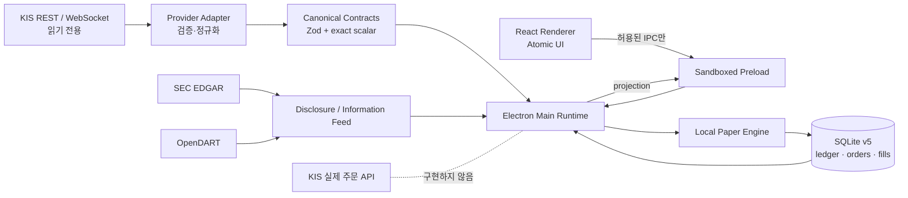

# PaperFlow — Personal HTS

> 한국투자증권(KIS)의 실제 읽기 전용 시세와 로컬 SQLite 모의계좌를 결합한 Electron 기반 개인용 HTS

PaperFlow는 **시장 데이터는 실제 공급자에서 읽고, 주문과 체결은 이 PC 안에서만 재현**하는 개인용 모의투자 데스크톱 애플리케이션입니다.  
단순한 증권 UI 클론이 아니라 실시간 스트림 정규화, 호가 기반 부분체결, 불변 원장, 장 상태·데이터 freshness, Electron 보안 경계를 함께 설계한 풀스택 포트폴리오 프로젝트입니다.


> 2026-07-21 KIS 읽기 전용 실전 데이터가 준비된 뒤 Electron에서 자동 촬영한 화면입니다. 장 마감 후 캡처이므로 현재가·10호가·차트는 공급자가 반환한 당일 마지막 스냅샷이며, 실제 주문은 전송되지 않습니다. API 키와 계좌 정보는 캡처·저장소에 포함하지 않았습니다.

## 프로젝트 한눈에 보기

| 관점 | 구현 내용 |
| --- | --- |
| 해결하려는 문제 | 실제 호가·차트를 보면서도 증권사에 주문을 전송하지 않는 현실적인 모의투자 환경 |
| 핵심 사용자 경험 | 동일 종목의 10호가, 캔들 차트, 거래량·거래대금, 현재가·전일 종가, 체결강도, 로컬 주문을 한 화면에 배치 |
| 데이터 | KIS REST/WebSocket, SEC EDGAR, OpenDART, 선택형 시장 proxy |
| 데스크톱 | Electron main/preload/renderer 분리, 명시적 IPC allowlist, sandbox와 context isolation |
| 모의체결 | 시장성 주문의 visible depth 소진, 지정가 도달, 관측 체결량 기반 부분체결, 선택형 queue 추정 |
| 저장소 | 로컬 SQLite v5, 현금·주문·체결·포지션 projection, 재시작 복원 |
| 안전성 | KIS 실제 주문 endpoint 미구현, stale·장외 주문 이중 차단, renderer에 키·DB·Node API 미노출 |
| 검증 | TypeScript strict, Vitest 37개 파일·236개 테스트, SQLite/금지 endpoint 헬스체크 |

## 왜 이 프로젝트를 만들었나

일반적인 모의투자 화면은 실제 시장의 호가 흐름과 체결 가능성을 단순화하는 경우가 많습니다. PaperFlow는 다음 질문을 코드로 풀었습니다.

- 실제 호가 잔량을 사용하되 증권사 주문 API는 어떻게 완전히 배제할 것인가?
- WebSocket이 끊겼을 때 마지막 호가를 보여주면서도 체결에는 사용하지 않게 하려면?
- 지정가가 가격에 닿았다는 이유만으로 전량 체결하지 않고 실제 관측 거래량 안에서 어떻게 부분체결할 것인가?
- 앱을 재시작해도 현금·체결·포지션을 어떻게 동일하게 복원할 것인가?
- KIS·SEC·OpenDART의 서로 다른 응답을 renderer가 공급자 원본 필드 없이 어떻게 소비하게 할 것인가?

그 결과 **읽기 전용 시장 데이터 계층과 로컬 주문 계층을 구조적으로 분리**하고, 데이터 상태가 불확실하면 체결을 중단하는 fail-closed 방식을 선택했습니다.

## 주요 화면

### 종목 작업공간

- KRX 10호가 배열과 캔들 차트를 한 페이지에 유지
- 모든 호가 행의 왼쪽 옅은 파란 박스는 로컬 매도, 오른쪽 옅은 빨간 박스는 로컬 매수
- KIS `CTTR` 기반 체결강도 표시
- 1·5·15·30·60분, 4시간, 일봉, 주봉
- 1일·6개월·1년·5년 조회 범위
- SMA/EMA와 사용자 체결 가격 마커
- 하단 단일 영역에서 거래량과 거래대금을 함께 표시
- 오른쪽 가격 축에 실시간 현재가와 전일 종가 기준선 표시

### 다크·라이트 테마


색을 컴포넌트에 직접 박아 넣지 않고 semantic token으로 관리해 dark/light/system 모드를 동일한 정보 구조로 지원합니다.

### 반응형 데스크톱 레이아웃


기본 창은 1800×1040, 최소 창은 1366×800입니다. 좁은 화면에서는 호가와 차트를 우선 유지하고 부가 패널을 다음 행으로 재배치합니다.

### 실제 일일 순위와 뉴스·공시

| KIS 국내 일일 거래 순위 | KIS 뉴스·SEC EDGAR 정보 피드 |
| --- | --- |
|  |  |

순위 화면은 KIS가 반환한 당일 현재가·등락률·거래량·거래량 증가율·거래대금을 사용하며, 행을 선택하면 같은 종목의 통합 작업공간으로 이동합니다. 정보 피드는 KIS 국내 뉴스 제목과 SEC EDGAR 공시를 로컬에 저장한 뒤 공급자·수신 시점을 함께 표시합니다.

포트폴리오 캡처는 `FIXTURE UI`, `SYNTHETIC_UI_FIXTURE`가 없고 현재가·20개 호가 행·차트 봉·대상 페이지 데이터가 모두 준비된 경우에만 저장됩니다. 키가 없거나 공급자가 응답하지 않으면 임의 숫자를 만들지 않고 빈 상태 또는 오류를 표시합니다.

## 시스템 아키텍처



### 프로세스 경계

```text
Renderer
  └─ 화면 렌더링, 사용자 입력, canonical projection 소비
       │
       ▼
Preload
  └─ 고정된 IPC 채널, 입력·응답 schema 검증
       │
       ▼
Main + Node worker
  ├─ KIS 인증과 REST/WebSocket
  ├─ 시장 세션·freshness 관리
  ├─ 로컬 모의체결 엔진
  └─ SQLite repository
```

renderer는 KIS App Key, 접근 토큰, DB 연결, 파일시스템, 범용 Node API에 접근할 수 없습니다.

## 기술 스택

| 영역 | 기술 | 선택 이유 |
| --- | --- | --- |
| Desktop | Electron 43 | 로컬 DB와 네이티브 데스크톱 UX를 함께 제공 |
| UI | React 19, TypeScript 5.8 | 상태 기반 화면과 엄격한 계약 중심 개발 |
| Build | Vite 7, esbuild | renderer와 Electron 프로세스의 빠른 분리 빌드 |
| Validation | Zod 4 | 외부 API·IPC 경계에서 런타임 schema 검증 |
| Realtime | `ws` | KIS WebSocket 프레임과 재연결 상태 관리 |
| Storage | SQLite, `better-sqlite3` | 개인용 로컬 원장, 트랜잭션, 재시작 복원 |
| Test | Vitest | adapter·체결·DB·UI 안전 규칙의 빠른 회귀검증 |
| UI System | Atomic components, CSS tokens, Lucide | 재사용 가능한 컴포넌트와 테마 일관성 |

## 기술적으로 집중한 부분

### 1. 공급자 원본과 제품 모델의 분리

KIS raw 필드는 adapter 밖으로 노출하지 않습니다. 공식 프레임과 실제 관측 변형을 exact layout으로 구분하고 canonical market event로 정규화합니다.

```text
KIS frame → layout validation → normalized tick/order book
          → desktop projection → renderer view model
```

빈 값은 숫자 `0`으로 바꾸지 않고 `null`, `UNAVAILABLE`, `STALE` 등 의미가 있는 상태로 전달합니다.

### 2. 실제 주문이 불가능한 구조

- KIS endpoint registry에는 인증·시세 조회만 존재
- 실제 주문 path와 주문 TR ID를 금지 테스트로 검사
- `actualOrderCapability = FORBIDDEN`
- renderer와 runtime이 각각 장 상태·freshness를 확인
- 최종 주문 결과는 로컬 `submitPaperOrder`와 SQLite만 변경

화면의 매수·매도는 실제 시장에 아무 요청도 전송하지 않습니다.

### 3. 호가 기반 로컬 체결

초기 보수적 모델은 다음 규칙을 따릅니다.

- 시장성 주문: 실제 visible 호가 잔량 순서로 가상 체결
- 지정가 주문: 실제 체결가가 지정가에 도달·통과한 관측 수량 안에서 부분체결
- 보유수량 초과 매도 차단
- 수수료·세금 반영
- KRX 정규 연속매매 세션에서만 신규 모의주문 허용

선택형 `ADVANCED_QUEUE_V1`은 주문 당시 선행 대기수량을 추정하고 실제 체결량과 동일 가격 호가 감소를 사용해 queue를 차감합니다. 실제 거래소 queue 순위를 안다고 주장하지 않으며 UI와 DB에 `QUEUE_ESTIMATED`를 유지합니다.

### 4. 재시작 가능한 불변 원장

현금·주문·체결을 SQLite transaction으로 기록하고 포지션과 손익은 projection으로 재구성합니다. 누적거래량 high-watermark와 event receipt를 저장해 재시작 후 같은 체결 tick을 다시 반영하지 않습니다.

### 5. point-in-time 정보 모델

SEC EDGAR와 OpenDART 공시는 수신 시점, 원문 링크, evidence ID를 보존합니다. 뉴스·공시와 가격 반응의 상관관계를 확정 인과로 승격하지 않으며, 라이선스 없는 Reuters 본문을 수집하지 않습니다.

## 기능 범위

| 상태 | 범위 |
| --- | --- |
| 구현 | KIS 국내 현재가·10호가·체결 WebSocket, REST 초기 스냅샷 |
| 구현 | 국내 1분봉·수정 일봉과 로컬 5/15/30/60분·4시간·주봉 집계 |
| 구현 | 거래량·거래대금·등락률 순위 adapter와 종목 작업공간 이동 |
| 구현 | 현재가·전일 종가 기준선, SMA/EMA, 체결 마커 |
| 구현 | SQLite 모의계좌, 시장성/지정가, 부분체결, queue 추정 |
| 구현 | KIS 국내·해외 뉴스 제목, SEC EDGAR, OpenDART polling 기반 정보 피드 |
| 구현 | dark/light/system 테마, 1800px/1366px 데스크톱 레이아웃 |
| 기반 구현 | point-in-time catalyst·theme leadership 계약과 순수 분석 테스트 |
| 미연결 | 선택 종목별 뉴스·공시·테마를 결합한 `왜 올랐나/내렸나` 실시간 UI projection |
| 제한 | NXT는 읽기 전용 진단·표시 범위이며 로컬 체결 근거로 사용하지 않음 |
| 제한 | 분봉 거래대금은 KIS 개별 봉 값이 없어 `UNAVAILABLE` 유지 |
| 예정 | 미국 종목 작업공간, NXT venue별 장 상태·VI adapter |
| 예정 | DART 키 승인 후 실데이터 운영 검증, 공시 본문 번역 queue |
| 예정 | Windows installer/asar와 OS 암호화 credential 입력 UI |

## 로컬 실행

### 요구사항

- Node.js 22 이상
- Windows 10/11
- KIS Developers에서 발급한 개인 API key

```powershell
npm install
Copy-Item .env.local.example .env.local
npm run desktop:start
```

개발 모드:

```powershell
npm run desktop:dev
```

### 환경 변수

비밀키는 커밋하지 않는 `.env.local`에만 저장합니다.

```dotenv
KIS_PAPER_APP_KEY=
KIS_PAPER_APP_SECRET=

# 실제 주문용이 아니라 실전 시세 조회용 프로필
KIS_PROD_DATA_APP_KEY=
KIS_PROD_DATA_APP_SECRET=

KIS_LIVE_ACK=READ_ONLY_MARKET_DATA
SEC_USER_AGENT=your-name your-email@example.com
DART_CRTFC_KEY=
```

`KIS_LIVE_ACK=READ_ONLY_MARKET_DATA`가 없으면 제품 런타임은 실시간 연결을 활성화하지 않습니다.

## 품질 검증

```powershell
npm run check
npm run desktop:build
npm run desktop:smoke:preload
npm run desktop:capture
npm run desktop:capture:live
```

- `desktop:capture`: 키 없이 UI 회귀를 확인하는 fixture 캡처
- `desktop:capture:live`: `.env.local`의 KIS 읽기 전용 데이터로 준비 조건을 검증한 뒤 README용 실제 데이터 캡처

현재 기준:

- TypeScript application/renderer/Electron typecheck 통과
- Vitest **37개 파일, 236개 테스트** 통과
- SQLite integrity, foreign key, migration checksum, immutable ledger trigger 검사 통과
- KIS 실제 주문 endpoint 금지 registry 검사 통과
- sandboxed preload smoke 통과
- Electron production renderer/main/preload build 통과

실제 네트워크를 사용하는 별도 진단:

```powershell
npm run health:live
npm run probe:kr
npm run probe:nxt
npm run probe:rankings
```

이 명령들은 API 호출 제한과 시장 운영시간의 영향을 받습니다.

## 프로젝트 구조

```text
PaperTrading/
├─ apps/desktop/
│  ├─ src/main/          # Electron shell, IPC, runtime supervision
│  ├─ src/preload/       # 최소 권한 bridge와 schema 검증
│  ├─ src/renderer/      # React UI, Atomic components, chart
│  └─ src/shared/        # desktop IPC contracts
├─ src/
│  ├─ kis/               # auth, REST, WebSocket, ranking, news
│  ├─ contracts/         # canonical market/order/event schemas
│  ├─ simulation/        # 주문 검증과 모의체결 엔진
│  ├─ storage/           # SQLite migrations/repositories/health
│  ├─ disclosures/       # SEC EDGAR, OpenDART
│  ├─ analysis/          # theme leadership, catalyst evidence
│  └─ cli/               # health와 provider probe
├─ tests/                # contract, adapter, DB, safety tests
├─ docs/                 # 요구사항·아키텍처·ADR·운영 문서
└─ scripts/              # Electron smoke와 화면 캡처 자동화
```

## 설계 문서

- [제품 요구사항](docs/01-product-requirements.md)
- [화면과 사용자 흐름](docs/02-ux-workspaces.md)
- [시스템 아키텍처](docs/03-system-architecture.md)
- [KIS 데이터 연동](docs/04-kis-integration.md)
- [데이터 모델과 모의체결](docs/05-data-and-simulation.md)
- [보안·테스트·운영](docs/07-security-testing-operations.md)
- [React 프론트엔드와 UI 시스템](docs/10-frontend-ui-system.md)
- [SEC·OpenDART 공시와 번역](docs/12-disclosure-integration.md)
- [실시간 시장·파생상품 범위](docs/13-realtime-market-coverage.md)
- [소형주 급등 근거 분석](docs/15-small-cap-catalyst-analysis.md)
- [거래대금 기반 주도 테마](docs/17-theme-leadership.md)
- [실제 호가 기반 로컬 모의주문](docs/18-orderbook-paper-trading.md)
- [글로벌 사건과 시장 영향](docs/19-global-event-market-context.md)
- [통합 종목 작업공간 UI](docs/20-integrated-workspace-ui.md)
- [ADR-001: 제품 런타임의 KIS 직접 연동](docs/adr/001-direct-kis-runtime.md)

## 현재 한계와 다음 단계

1. 실사용 기본 범위는 국내 단일 종목 작업공간입니다. 다중 종목 WebSocket 구독과 미국 작업공간은 후속 범위입니다.
2. 장 마감 후 REST 호가는 마지막 스냅샷으로 보존하지만 신규 모의주문은 차단합니다.
3. VI·동시호가·상하한가 순수 정책은 테스트되어 있으나 KIS canonical 장 이벤트 adapter가 완성되기 전 runtime 체결에는 사용하지 않습니다.
4. SEC form명 일부는 한국어로 정규화하지만 공시 본문 전체 자동 번역은 아직 연결하지 않았습니다.
5. 차트 아래 상승·하락 원인 패널은 KIS 뉴스·공시·가격 데이터를 선택 종목·시점별 evidence로 결합하는 runtime이 아직 연결되지 않아 실제 Electron 모드에서는 빈 상태를 표시합니다.
6. 배포용 installer, OS 암호화 secret vault, migration 전 자동 backup은 출시 전 필수 작업입니다.

## 주의사항

이 프로젝트는 개인 학습·포트폴리오용 모의투자 도구이며 투자 자문 또는 실제 주문 서비스가 아닙니다. KIS·SEC·OpenDART API 정책, 호출 제한, 시장 운영시간과 데이터 라이선스는 각 공식 문서를 따라야 합니다.
