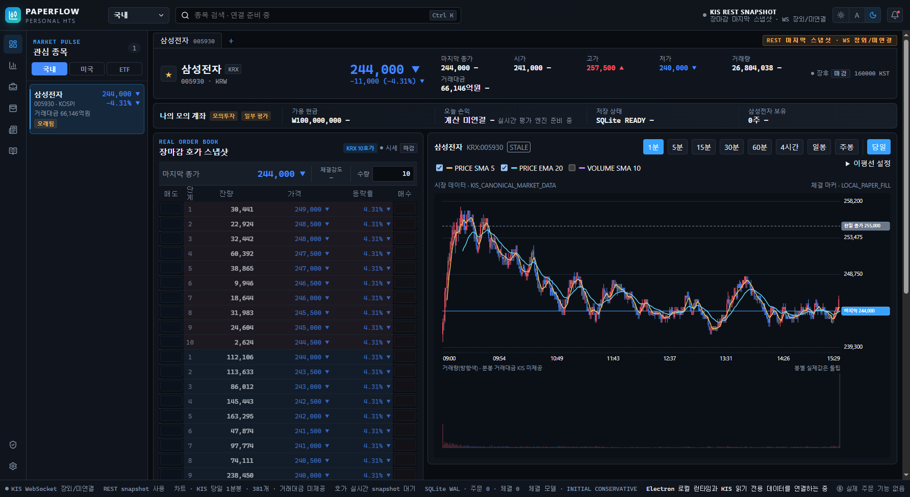
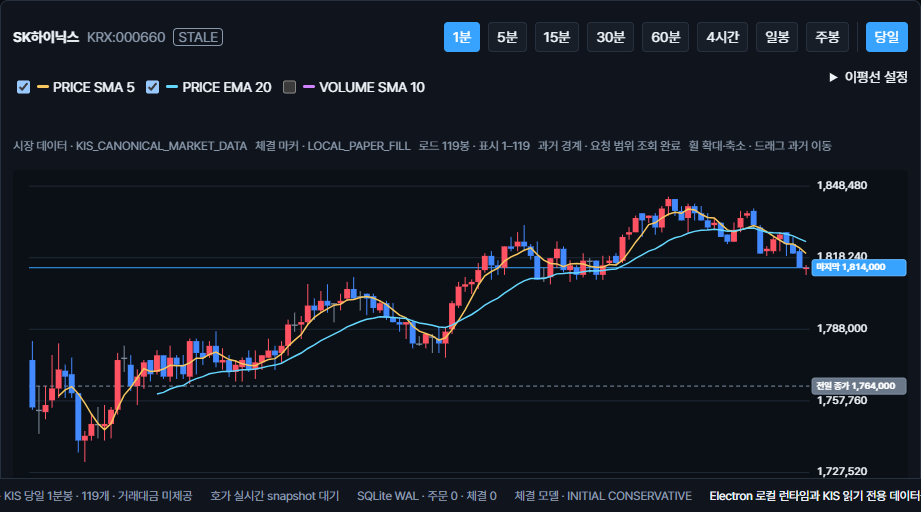
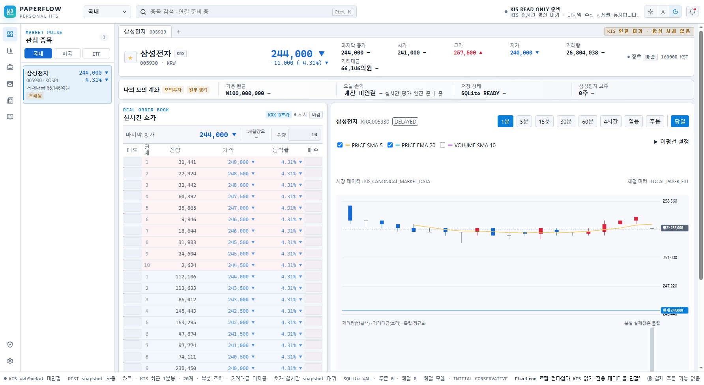
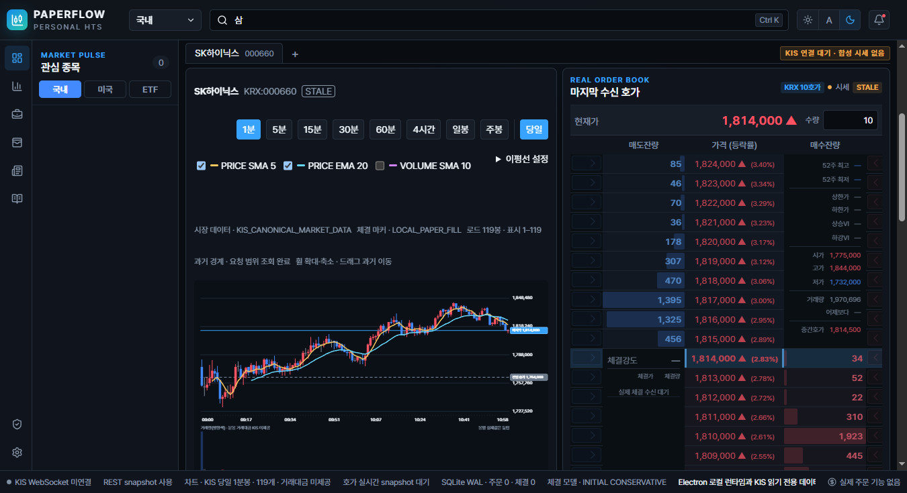
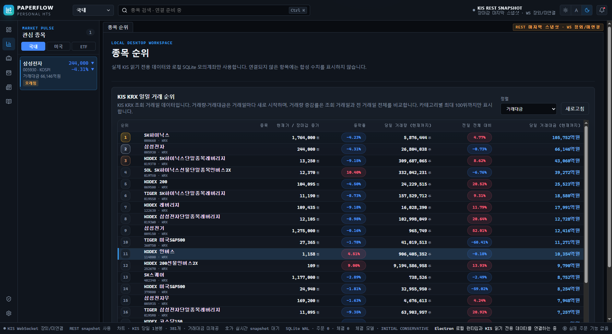
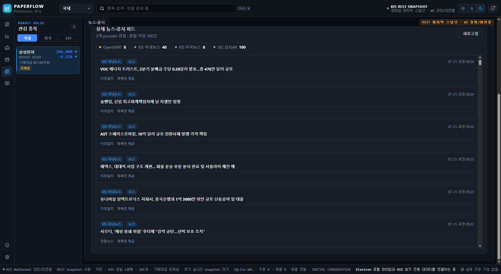
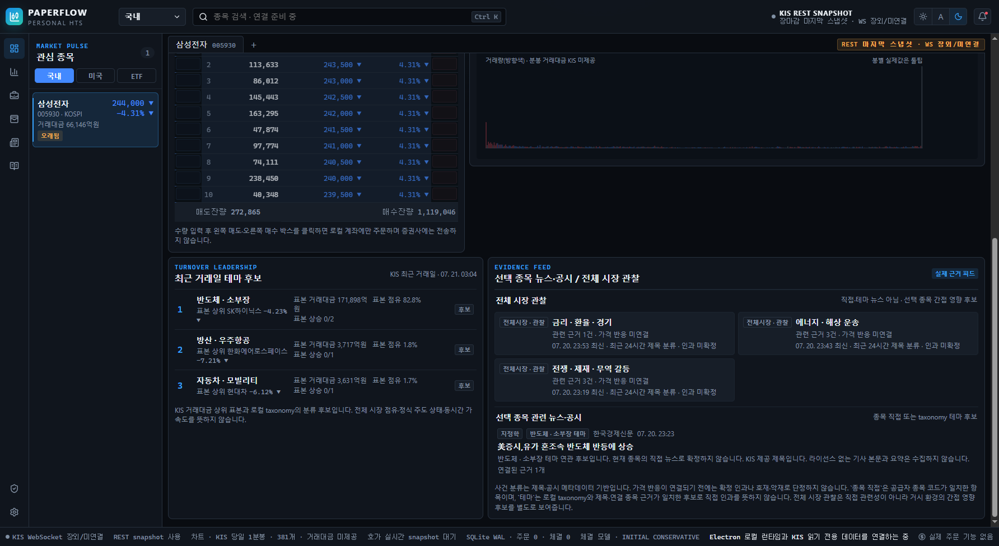
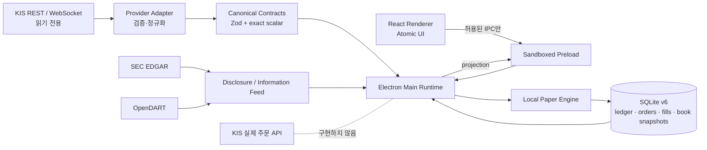

# PaperFlow — Personal HTS

> 한국투자증권(KIS)의 실제 읽기 전용 시세와 로컬 SQLite 모의계좌를 결합한 Electron 기반 개인용 HTS

PaperFlow는 **시장 데이터는 실제 공급자에서 읽고, 주문과 체결은 이 PC 안에서만 재현**하는 개인용 모의투자 데스크톱 애플리케이션입니다.  
단순한 증권 UI 클론이 아니라 실시간 스트림 정규화, 호가 기반 부분체결, 불변 원장, 장 상태·데이터 freshness, Electron 보안 경계를 함께 설계한 풀스택 포트폴리오 프로젝트입니다.



> 2026-07-21 KIS 읽기 전용 실전 데이터가 준비된 뒤 Electron에서 자동 촬영한 화면입니다. 장 마감 후 캡처이므로 현재가·10호가·차트는 공급자가 반환한 당일 마지막 스냅샷이며, 실제 주문은 전송되지 않습니다. API 키와 계좌 정보는 캡처·저장소에 포함하지 않았습니다.

## 프론트엔드 포트폴리오 핵심

PaperFlow의 프론트엔드는 예쁜 증권 화면을 재현하는 데서 끝나지 않고, **실시간 금융 데이터의 상태와 품질을 사용자가 오해하지 않도록 표현하는 것**에 집중했습니다.

| 프론트엔드 역량 | 구현 사례 |
| --- | --- |
| 복잡한 정보 구조 설계 | 현재가·전일 종가·10호가·체결강도·캔들·거래량·거래대금·보유 상태를 단일 종목 작업공간에 배치 |
| 서버 상태 모델링 | `LOADING/READY/PARTIAL/STALE/OFFLINE/ERROR`를 분리하고 공급자 미응답을 `0`이나 합성 값으로 대체하지 않음 |
| 데이터 시각화 정확성 | 실제 KRX 정규장 1분봉 381개를 1:1 보존하고, 장기 차트만 OHLCV 보존 downsampling 적용 |
| 실시간 UI 상태 | WebSocket tick으로 진행 봉의 고가·저가·종가를 누적하고 시간 경계에서 새 봉 생성 |
| 디자인 시스템 | Atomic presentation component, semantic color token, dark/light/system theme, 1800px·1366px 레이아웃 |
| 상호작용 설계 | KIS 종목 마스터 자동완성, 순위 행에서 종목 작업공간 이동, 호가 행 좌·우 클릭으로 로컬 매도·매수, 키보드 crosshair 조작 |
| 안전한 데이터 표현 | 분봉 거래대금처럼 공급자 의미가 불충분한 값은 `미제공`으로 표시하고 확정 인과·호재·악재를 생성하지 않음 |
| 데스크톱 보안 경계 | renderer는 KIS 키·SQLite·Node API에 접근하지 않고 검증된 preload IPC만 사용 |

### 화면에서 확인할 수 있는 프론트엔드 결정

- 가격 축과 현재가·전일 종가 기준선을 차트 오른쪽에 고정
- 1분봉은 전체 장 데이터를 촘촘하게 표시하고 5년 일봉처럼 긴 데이터만 시각 버킷으로 축약
- 봉 시간축을 가격 영역과 거래량 영역 사이에 두고 분봉은 시·분, 장기 일·주봉은 날짜·연도로 자동 전환
- 거래량과 거래대금을 같은 하단 영역에 배치하되 서로 독립적으로 정규화
- KIS 분봉 거래대금은 당일 누적 필드이므로 개별 봉 값처럼 그리지 않고 `KIS 미제공`으로 안내
- 장 마감 후 마지막 호가와 차트는 유지하지만 주문 상호작용은 비활성화
- 검색·순위 선택은 관심종목을 변경하지 않고, 헤더 별표를 누른 경우에만 로컬 관심종목에 추가·삭제
- 장전 첫 조회에서 KIS 잔량이 비어 있으면 KIS 마스터에서 `STOCK`으로 확인된 종목만 실제 현재가 기준 가격 단위를 `잔량 미수신`으로 표시하고 모의 체결에는 사용하지 않음
- 실제 뉴스 제목과 공식 공시는 중립 근거로 표시하고, 시장 반응이 연결되기 전에는 `관찰·인과 미확정`으로 제한
- 종목 뉴스는 공급자 종목 코드가 일치한 `종목 직접`과 반도체·AI·방산·원전·전력망 등 taxonomy가 일치한 `테마 연관`을 분리 표시

## 프로젝트 한눈에 보기

| 관점 | 구현 내용 |
| --- | --- |
| 해결하려는 문제 | 실제 호가·차트를 보면서도 증권사에 주문을 전송하지 않는 현실적인 모의투자 환경 |
| 핵심 사용자 경험 | 동일 종목의 10호가, 캔들 차트, 거래량·거래대금, 현재가·전일 종가, 체결강도, 로컬 주문을 한 화면에 배치 |
| 데이터 | KIS REST/WebSocket, SEC EDGAR, OpenDART, 국내 공식 지수와 선택형 시장 proxy |
| 투자자 수급 | KOSPI·KOSDAQ 개인/외국인/기관 스냅샷과 종목별 개인/외국인/기관/프로그램 매매를 KIS 실전 읽기 전용 REST로 투영 |
| 데스크톱 | Electron main/preload/renderer 분리, 명시적 IPC allowlist, sandbox와 context isolation |
| 모의체결 | 시장성 주문의 visible depth 소진, 지정가 도달, 관측 체결량 기반 부분체결, 선택형 queue 추정 |
| 저장소 | 로컬 SQLite v6, 현금·주문·체결·포지션·종목별 마지막 실호가 projection, 재시작 복원 |
| 안전성 | KIS 실제 주문 endpoint 미구현, stale·장외 주문 이중 차단, renderer에 키·DB·Node API 미노출 |
| 검증 | TypeScript strict, Vitest 51개 파일·301개 테스트, SQLite/금지 endpoint 헬스체크 |

## 왜 이 프로젝트를 만들었나

일반적인 모의투자 화면은 실제 시장의 호가 흐름과 체결 가능성을 단순화하는 경우가 많습니다. PaperFlow는 다음 질문을 코드로 풀었습니다.

- 실제 호가 잔량을 사용하되 증권사 주문 API는 어떻게 완전히 배제할 것인가?
- WebSocket이 끊겼을 때 마지막 호가를 보여주면서도 체결에는 사용하지 않게 하려면?
- 지정가가 가격에 닿았다는 이유만으로 전량 체결하지 않고 실제 관측 거래량 안에서 어떻게 부분체결할 것인가?
- 앱을 재시작해도 현금·체결·포지션을 어떻게 동일하게 복원할 것인가?
- KIS·SEC·OpenDART의 서로 다른 응답을 renderer가 공급자 원본 필드 없이 어떻게 소비하게 할 것인가?

그 결과 **읽기 전용 시장 데이터 계층과 로컬 주문 계층을 구조적으로 분리**하고, 데이터 상태가 불확실하면 체결을 중단하는 fail-closed 방식을 선택했습니다.

## 주요 화면

### 종목 작업공간

- KIS 공식 KOSPI·KOSDAQ 종목 마스터 기반 종목명·종목코드 자동완성
- KIS 공식 NASDAQ·NYSE·AMEX 해외 종목 마스터 기반 한글명·영문명·티커 자동완성
- 완성형 한글 한 글자부터 최대 20개 후보, 종목코드는 첫 숫자부터 검색
- `Ctrl+K`, 방향키, Enter, 마우스로 검색 결과를 선택해 같은 작업공간 전환
- 검색·순위 행 선택은 관심종목에 자동 등록하지 않으며, 헤더 별표만 관심종목 추가·해제 이벤트로 사용
- KRX 10호가 배열과 캔들 차트를 한 페이지에 유지
- 모든 호가 행의 왼쪽 옅은 파란 박스는 로컬 매도, 오른쪽 옅은 빨간 박스는 로컬 매수
- KIS `CTTR` 기반 체결강도 표시
- 1·5·15·30·60분, 4시간, 일봉, 주봉
- 1일·6개월·1년·5년 조회 범위
- SMA/EMA와 사용자 체결 가격 마커
- 하단 단일 영역에서 거래량과 거래대금을 함께 표시
- 가격 봉과 거래량 사이의 반응형 시간축, 선택 봉의 KST 연·월·일·시·분 툴팁
- 6개월·1년·5년 과거 봉을 마우스 휠로 확대·축소하고 드래그해 이전 구간 이동
- 오른쪽 가격 축에 실시간 현재가와 전일 종가 기준선 표시

### 미국 주식 작업공간

미국 탭은 국내 데이터를 화면에서 숨기는 수준이 아니라 별도의 종목·통화·세션·순위
경계로 동작합니다.

- KIS 공식 NASDAQ·NYSE·AMEX 마스터에서 한글명·영문명·티커 검색
- 선택 거래소와 티커를 보존해 REST 초기 시세, WebSocket 호가·체결, 차트를 같은 종목으로 연결
- 미국 동부시간 기준 프리마켓·정규장·애프터마켓 세션을 판정하고 세션 전환 후에도 작업공간 유지
- KIS가 제공하는 실제 1호가와 최근 체결만 표시하며, 제공되지 않은 다단계 호가 잔량은 생성하지 않음
- 실제 호가·체결을 근거로 로컬에서만 모의 매수·매도하고 USD 현금·보유수량·평균단가를 별도 관리
- 당일 1분봉과 로컬 집계 5·15·30·60분·4시간 봉, 기본 SMA 5·20·60·120 표시
- 차트 내부 휠은 확대·축소에만 사용하고 페이지 스크롤 전파 차단
- 미국 가격은 원본 exact decimal을 보존하고 화면에서만 소수 둘째 자리 이후를 절삭해 표시
- 미국 관심종목에는 미국 종목만, 국내 관심종목에는 국내 종목만 표시
- 관심종목·종목 헤더·순위·보안 상태·포트폴리오·체결 내역 전반에서 미국 종목은 `NASDAQ`·`NYSE`·`AMEX`와 USD로 표시하며 `KRX`·원화 fallback을 사용하지 않음

미국 시세가 stale이거나 호가·체결 채널 중 하나가 준비되지 않으면 마지막 관측값은 상태와
함께 표시할 수 있지만 신규 로컬 체결은 fail-closed로 차단합니다.

### 실제 종목 마스터 자동완성

검색은 임시 watchlist가 아니라 KIS가 배포하는 KOSPI·KOSDAQ 종목 마스터를
CP949 fixed-width 형식으로 검증·정규화한 로컬 인덱스를 사용합니다. 마스터는
Electron 사용자 데이터 폴더에 24시간 캐시하고 네트워크 장애 시 마지막 검증본을
사용합니다. `ㅅ` 같은 초성만으로는 검색하지 않으며 `삼`처럼 완성된 한글 한
글자부터 자동완성을 시작합니다.

### 실제 KIS 1분봉 차트 상세



2026-07-20 삼성전자 정규장 `09:00~15:30 KST`의 실제 KIS 1분봉 381개를 시각 축약 없이 1:1로 표시했습니다. 짧은 조회도 오른쪽에 촘촘히 붙이고 캔들 폭을 봉 간격의 90%로 잡아 불필요한 공백을 줄였으며, 가격 영역과 거래량 영역 사이에는 실제 봉 시각을 기준으로 한 반응형 시간축을 배치했습니다.

### 다크·라이트 테마



색을 컴포넌트에 직접 박아 넣지 않고 semantic token으로 관리해 dark/light/system 모드를 동일한 정보 구조로 지원합니다.

### 반응형 데스크톱 레이아웃



기본 창은 1800×1040, 최소 창은 1366×800입니다. 좁은 화면에서는 차트가 호가 패널 높이에 맞춰 불필요하게 늘어나지 않도록 각 패널을 상단 정렬하고, 부가 패널은 다음 행으로 재배치합니다.

### 실제 일일 순위와 뉴스·공시

| KIS 국내 일일 거래 순위 | KIS 뉴스·SEC EDGAR 정보 피드 |
| --- | --- |
|  |  |

순위 화면은 KIS가 반환한 당일 현재가·등락률·거래량·거래량 증가율·거래대금을 사용하며 상승률·하락률·거래량·거래량 증가율·거래대금 카테고리별 최대 100위까지만 표시합니다. 국내 선택 시 KRX만 표시하고, 미국 선택 시 NASDAQ·NYSE·AMEX 전용 REST 결과를 합쳐 미국 종목만 다시 정렬합니다. 행을 선택하면 거래소 식별자를 보존한 채 같은 종목의 통합 작업공간으로 이동합니다.

정보 피드는 시장별로 분리됩니다. 국내는 KIS 국내뉴스와 OpenDART, 미국은 KIS 미국뉴스·Finnhub 회사뉴스·SEC EDGAR만 표시합니다. 공급자 pill로 필터링할 수 있고, 뉴스·공시 행을 선택하면 상세 모달에서 제목·출처·게시시각·허용된 요약과 공식 원문 링크를 확인합니다. KIS 제목 전용 데이터는 제공 권한을 명시하고 임의 본문을 만들지 않습니다.

포트폴리오 캡처는 `FIXTURE UI`, `SYNTHETIC_UI_FIXTURE`가 없고 현재가·20개 호가 행·차트 봉·대상 페이지 데이터가 모두 준비된 경우에만 저장됩니다. 키가 없거나 공급자가 응답하지 않으면 임의 숫자를 만들지 않고 빈 상태 또는 오류를 표시합니다.

### 거래대금 기반 테마 후보와 시장 맥락



- KIS 최근 거래일 거래대금 상위 표본을 로컬 taxonomy로 분류
- `표본 거래대금`, `표본 내 점유`, `표본 내 상승 종목`, `표본 상위 기여 종목`만 표시
- 전체 시장 분모·종목 master·동시간 20일 baseline이 없으므로 정식 `LEADING` 상태와 가속도는 생성하지 않음
- KIS 뉴스와 SEC·OpenDART 공시 제목에서 금리·환율·경기, 에너지·해상 운송, 전쟁·제재·무역 갈등, AI·기술 경쟁 사건 후보를 정규화
- 삼성전자에 방산 뉴스가 섞이는 식의 오분류를 막기 위해 관련 종목 코드와 선택 종목의 테마 교집합을 검사하고, 직접 뉴스와 테마 후보를 별도 badge로 표시
- 사건 카드는 `WATCH`만 사용하며 가격 반응은 `미연결`, 인과는 `미확정`으로 표시
- 호르무즈·유가·운임처럼 선택 종목에 간접 영향을 줄 수 있는 사건은 `전체 시장 관찰`로 분리하고, 나스닥 반도체·환율·국내 종목 반응이 연결되기 전에는 직접 관련 뉴스로 승격하지 않음

### 문제 해결 사례: 20개로 잘리던 1분봉

장 마감 후 새벽에 앱을 실행하면 현재가는 244,000원인데 차트는 장 초반 255,000원 부근의 20개 봉만 보여 가격대가 어긋나는 문제가 있었습니다.

원인은 장 시작 전 분봉 조회 커서가 현재 시각인 `02:xx`로 전달되고, KIS가 반환한 이전 거래일 15:30 데이터보다 커서가 작아 pagination이 중단되는 것이었습니다.

해결 과정:

1. 키를 출력하지 않는 `probe:chart`를 만들어 최초 KIS 원본 380봉, 09:01~15:30 KST, 241,000~257,500원 범위를 검증
2. 장 시작 전과 장 마감 후 커서를 최근 거래일 `15:30`으로 정규화
3. 30개보다 짧은 응답도 역방향 pagination하고 `09:00` 경계 페이지를 실제 요청한 뒤에만 완전 조회로 판정
4. 1분봉은 420개까지 downsampling하지 않아 실제 봉을 1:1 보존
5. 포트폴리오 캡처도 `부분 조회` 상태에서는 저장하지 않도록 readiness gate 강화

최종 실제 KIS 프로브에서 1분봉 **381개**, **09:00~15:30 KST**, 14페이지 완전 조회와 240,000~257,500원 범위를 확인했습니다. Electron 캡처 readiness는 실제 차트·호가 20행·테마·뉴스가 모두 준비된 경우에만 통과합니다.

## 시스템 아키텍처



### 프로세스 경계

```text
Renderer
  └─ 화면 렌더링, 사용자 입력, canonical projection 소비
       │
       ▼
Preload
  └─ 고정된 IPC 채널, 입력·응답 schema 검증
       │
       ▼
Main + Node worker
  ├─ KIS 인증과 REST/WebSocket
  ├─ 시장 세션·freshness 관리
  ├─ 로컬 모의체결 엔진
  └─ SQLite repository
```

renderer는 KIS App Key, 접근 토큰, DB 연결, 파일시스템, 범용 Node API에 접근할 수 없습니다.

## 기술 스택

| 영역 | 기술 | 선택 이유 |
| --- | --- | --- |
| Desktop | Electron 43 | 로컬 DB와 네이티브 데스크톱 UX를 함께 제공 |
| UI | React 19, TypeScript 5.8 | 상태 기반 화면과 엄격한 계약 중심 개발 |
| Build | Vite 7, esbuild | renderer와 Electron 프로세스의 빠른 분리 빌드 |
| Validation | Zod 4 | 외부 API·IPC 경계에서 런타임 schema 검증 |
| Realtime | `ws` | KIS WebSocket 프레임과 재연결 상태 관리 |
| Master data | KIS fixed-width master, `fflate` | KOSPI·KOSDAQ 공식 ZIP의 로컬 검색 인덱스와 오프라인 캐시 |
| Storage | SQLite, `better-sqlite3` | 개인용 로컬 원장, 트랜잭션, 재시작 복원 |
| Test | Vitest | adapter·체결·DB·UI 안전 규칙의 빠른 회귀검증 |
| UI System | Atomic presentation components, CSS tokens, Lucide | 재사용 가능한 표현 컴포넌트와 테마 일관성 |

## 기술적으로 집중한 부분

### 1. 공급자 원본과 제품 모델의 분리

KIS raw 필드는 adapter 밖으로 노출하지 않습니다. 공식 프레임과 실제 관측 변형을 exact layout으로 구분하고 canonical market event로 정규화합니다.

```text
KIS frame → layout validation → normalized tick/order book
          → desktop projection → renderer view model
```

빈 값은 숫자 `0`으로 바꾸지 않고 `null`, `UNAVAILABLE`, `STALE` 등 의미가 있는 상태로 전달합니다.

### 2. 실제 주문이 불가능한 구조

- KIS endpoint registry에는 인증·시세 조회만 존재
- 실제 주문 path와 주문 TR ID를 금지 테스트로 검사
- `actualOrderCapability = FORBIDDEN`
- renderer와 runtime이 각각 장 상태·freshness를 확인
- 최종 주문 결과는 로컬 `submitPaperOrder`와 SQLite만 변경

화면의 매수·매도는 실제 시장에 아무 요청도 전송하지 않습니다.

### 3. 호가 기반 로컬 체결

초기 보수적 모델은 다음 규칙을 따릅니다.

- 시장성 주문: 실제 visible 호가 잔량 순서로 가상 체결
- 지정가 주문: 실제 체결가가 지정가에 도달·통과한 관측 수량 안에서 부분체결
- 보유수량 초과 매도 차단
- 수수료·세금 반영
- KRX 정규 연속매매 세션에서만 신규 모의주문 허용

선택형 `ADVANCED_QUEUE_V1`은 주문 당시 선행 대기수량을 추정하고 실제 체결량과 동일 가격 호가 감소를 사용해 queue를 차감합니다. 실제 거래소 queue 순위를 안다고 주장하지 않으며 UI와 DB에 `QUEUE_ESTIMATED`를 유지합니다.

### 4. 재시작 가능한 불변 원장

현금·주문·체결을 SQLite transaction으로 기록하고 포지션과 손익은 projection으로 재구성합니다. 누적거래량 high-watermark와 event receipt를 저장해 재시작 후 같은 체결 tick을 다시 반영하지 않습니다.

### 5. point-in-time 정보 모델

SEC EDGAR와 OpenDART 공시는 수신 시점, 원문 링크, evidence ID를 보존합니다. 뉴스·공시와 가격 반응의 상관관계를 확정 인과로 승격하지 않으며, 라이선스 없는 Reuters 본문을 수집하지 않습니다.

## 기능 범위

| 상태 | 범위 |
| --- | --- |
| 구현 | KIS 국내 현재가·10호가·체결 WebSocket, REST 초기 스냅샷 |
| 구현 | 국내 1분봉·수정 일봉과 로컬 5/15/30/60분·4시간·주봉 집계 |
| 구현 | 국내 및 미국 NASDAQ·NYSE·AMEX 거래량·거래대금·상승률·하락률·거래증가율 순위 adapter, 카테고리별 최대 100위, 종목 작업공간 이동 |
| 구현 | KIS KOSPI·KOSDAQ 종목 마스터 기반 한글명·종목코드 자동완성과 키보드 탐색 |
| 구현 | 현재가·전일 종가 기준선, SMA/EMA, 체결 마커 |
| 구현 | KIS 최근 거래일 거래대금 상위 표본 기반 테마 후보와 coverage 경고 |
| 구현 | KOSPI·KOSDAQ·KOSPI200 공식 REST 스냅샷과 QQQ·SPY·IWM·USO·GLD ETF proxy 시장 스트립 |
| 표시 | KOSPI200 주·야간, KOSDAQ150, NQ·ES·CL·GC 선물은 실제 월물·시세 권한 연결 전까지 `권한 필요/연결 예정`으로 값 없이 표시 |
| 구현 | 종목 직접 뉴스와 반도체·AI·방산·원전·전력망 등 테마 연관 후보 분리, 시장 맥락 `WATCH`와 인과 미확정 표현 |
| 구현 | SQLite 모의계좌, 시장성/지정가, 부분체결, queue 추정 |
| 구현 | KIS 국내·해외 뉴스 제목, SEC EDGAR, OpenDART polling 기반 정보 피드 |
| 구현 | Finnhub 선택 미국 종목 회사뉴스, provider별 필터, 뉴스·공시 상세 모달과 공식 원문 링크 |
| 구현 | dark/light/system 테마, 1800px/1366px 데스크톱 레이아웃 |
| 기반 구현 | point-in-time catalyst·theme leadership 계약과 순수 분석 테스트 |
| 미연결 | 선택 종목별 뉴스·공시·테마를 결합한 `왜 올랐나/내렸나` 실시간 UI projection |
| 구현 | KRX/NXT venue별 실시간 호가·체결과 세션별 로컬 모의체결 |
| 구현 | 미국 NASDAQ·NYSE·AMEX 1호가/체결 WebSocket, 프리·정규·애프터 세션, USD 100,000 로컬 계좌 |
| 제한 | 분봉 거래대금은 KIS 개별 봉 값이 없어 `UNAVAILABLE` 유지 |
| 구현 | 미국 NASDAQ·NYSE·AMEX REST 초기 1호가와 당일 1/5/15/30/60분·4시간 차트 |
| 예정 | 미국 장기 일·주봉 REST pagination, NXT VI adapter |
| 구현 | OpenDART 승인 키 기반 국내 공시 수집과 종목 연결 |
| 예정 | 공시 본문 전체 번역 queue |
| 예정 | Windows installer/asar와 OS 암호화 credential 입력 UI |

## 로컬 실행

### 요구사항

- Node.js 22 이상
- Windows 10/11
- KIS Developers에서 발급한 개인 API key

```powershell
npm install
Copy-Item .env.local.example .env.local
npm run desktop:start
```

개발 모드:

```powershell
npm run desktop:dev
```

### 환경 변수

비밀키는 커밋하지 않는 `.env.local`에만 저장합니다.

```dotenv
KIS_PAPER_APP_KEY=
KIS_PAPER_APP_SECRET=

# 실제 주문용이 아니라 실전 시세 조회용 프로필
KIS_PROD_DATA_APP_KEY=
KIS_PROD_DATA_APP_SECRET=

KIS_LIVE_ACK=READ_ONLY_MARKET_DATA
SEC_USER_AGENT=your-name your-email@example.com
DART_CRTFC_KEY=
FINNHUB_API_KEY=
```

`KIS_LIVE_ACK=READ_ONLY_MARKET_DATA`가 없으면 제품 런타임은 실시간 연결을 활성화하지 않습니다.

## 품질 검증

```powershell
npm run check
npm run desktop:build
npm run desktop:smoke:preload
npm run desktop:capture
npm run desktop:capture:live
```

- `desktop:capture`: 키 없이 UI 회귀를 확인하는 fixture 캡처
- `desktop:capture:live`: `.env.local`의 KIS 읽기 전용 데이터로 준비 조건을 검증한 뒤 README용 실제 데이터 캡처

현재 기준:

- TypeScript application/renderer/Electron typecheck 통과
- Vitest **57개 파일, 324개 테스트** 통과
- SQLite integrity, foreign key, migration checksum, immutable ledger trigger 검사 통과
- KIS 실제 주문 endpoint 금지 registry 검사 통과
- sandboxed preload smoke 통과
- Electron production renderer/main/preload build 통과

실제 네트워크를 사용하는 별도 진단:

```powershell
npm run health:live
npm run probe:kr
npm run probe:nxt
npm run probe:rankings
npm run probe:chart
npm run probe:market-context
```

이 명령들은 API 호출 제한과 시장 운영시간의 영향을 받습니다.

## 프로젝트 구조

```text
PaperTrading/
├─ apps/desktop/
│  ├─ src/main/          # Electron shell, IPC, runtime supervision
│  ├─ src/preload/       # 최소 권한 bridge와 schema 검증
│  ├─ src/renderer/      # React UI, Atomic components, chart
│  └─ src/shared/        # desktop IPC contracts
├─ src/
│  ├─ kis/               # auth, REST, WebSocket, ranking, news
│  ├─ contracts/         # canonical market/order/event schemas
│  ├─ simulation/        # 주문 검증과 모의체결 엔진
│  ├─ storage/           # SQLite migrations/repositories/health
│  ├─ disclosures/       # SEC EDGAR, OpenDART
│  ├─ analysis/          # theme leadership, catalyst evidence
│  └─ cli/               # health와 provider probe
├─ tests/                # contract, adapter, DB, safety tests
├─ docs/                 # 요구사항·아키텍처·ADR·운영 문서
└─ scripts/              # Electron smoke와 화면 캡처 자동화
```

## 설계 문서

- [제품 요구사항](docs/01-product-requirements.md)
- [화면과 사용자 흐름](docs/02-ux-workspaces.md)
- [시스템 아키텍처](docs/03-system-architecture.md)
- [KIS 데이터 연동](docs/04-kis-integration.md)
- [데이터 모델과 모의체결](docs/05-data-and-simulation.md)
- [보안·테스트·운영](docs/07-security-testing-operations.md)
- [React 프론트엔드와 UI 시스템](docs/10-frontend-ui-system.md)
- [SEC·OpenDART 공시와 번역](docs/12-disclosure-integration.md)
- [실시간 시장·파생상품 범위](docs/13-realtime-market-coverage.md)
- [소형주 급등 근거 분석](docs/15-small-cap-catalyst-analysis.md)
- [거래대금 기반 주도 테마](docs/17-theme-leadership.md)
- [실제 호가 기반 로컬 모의주문](docs/18-orderbook-paper-trading.md)
- [글로벌 사건과 시장 영향](docs/19-global-event-market-context.md)
- [통합 종목 작업공간 UI](docs/20-integrated-workspace-ui.md)
- [ADR-001: 제품 런타임의 KIS 직접 연동](docs/adr/001-direct-kis-runtime.md)

## 현재 한계와 다음 단계

1. 실시간 작업공간은 현재 선택한 국내 또는 미국 단일 종목을 구독합니다. 미국 과거 차트는 후속 범위입니다.
2. 장 마감 후 REST 호가는 마지막 스냅샷으로 보존하지만 신규 모의주문은 차단합니다.
3. VI·동시호가·상하한가 순수 정책은 테스트되어 있으나 KIS canonical 장 이벤트 adapter가 완성되기 전 runtime 체결에는 사용하지 않습니다.
4. SEC form명 일부는 한국어로 정규화하지만 공시 본문 전체 자동 번역은 아직 연결하지 않았습니다. KIS 뉴스는 제공 정책상 제목만 표시될 수 있습니다.
5. 시장 맥락은 실제 제목 기반 `WATCH` 후보까지 연결됐지만, 선택 종목의 상승·하락 원인을 가격 반응 window와 공식 evidence로 검증하는 causal assessment는 아직 연결되지 않았습니다.
6. 배포용 installer, OS 암호화 secret vault, migration 전 자동 backup은 출시 전 필수 작업입니다.

## 주의사항

이 프로젝트는 개인 학습·포트폴리오용 모의투자 도구이며 투자 자문 또는 실제 주문 서비스가 아닙니다. KIS·SEC·OpenDART API 정책, 호출 제한, 시장 운영시간과 데이터 라이선스는 각 공식 문서를 따라야 합니다.
